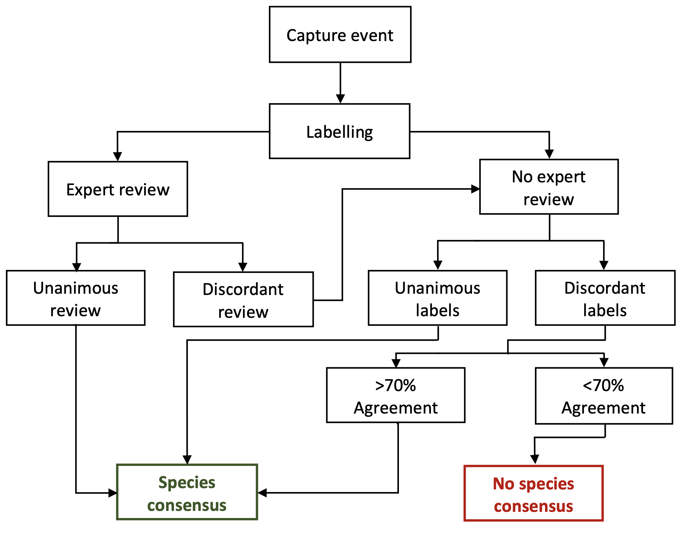
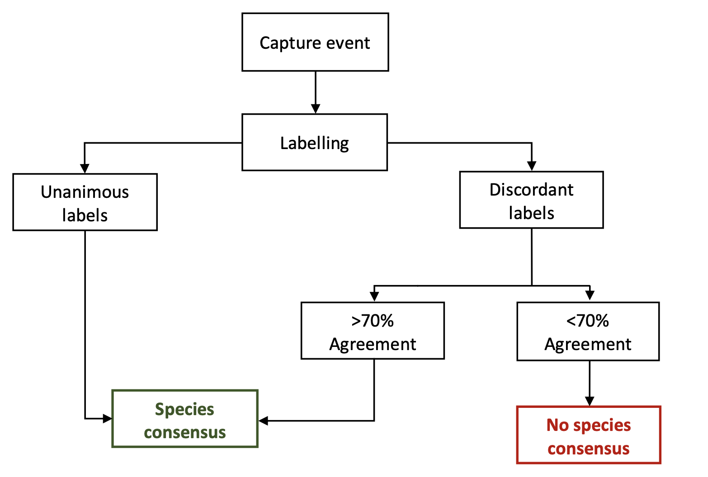
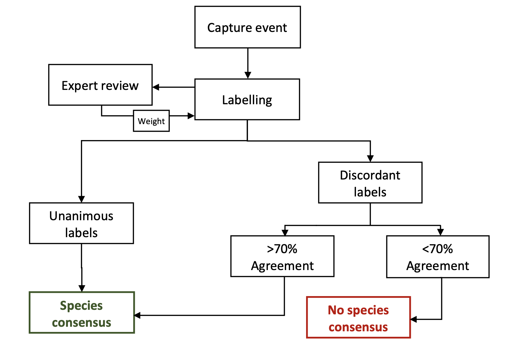

```{r setup, include=FALSE, message=FALSE, warning=FALSE}
rm(list = ls()) # clean global environment
knitr::opts_chunk$set(echo = TRUE)

library(reshape2)   # data manipulation
library(data.table) # data manipulation
library(Hmisc)      # data manipulation
library(lubridate)  # Dates & Time
library(zoo)        # handling NA
library(purrr)      # Function mapping
library(cowplot)    # plot grids
library(camtrapR)   # Camtrap Stuff
library(DT)         # Data tables 
library(googledrive) # Google drive
library(tidyverse)  # Tidyverse 

setwd("/Users/serpent/Documents/Senckenberg/WildLive!/Consensus Report") # set to folder
```

# Introduction

The following report focusses on the [WildLive!](https://wildlive.sgn.one/de/) species consensus. R code can either be displayed or hidden using the toggling option (top right corner). The consensus is based on labels assigned to animals caught on camera trap images. Citizen scientists classified the species (or other taxonomic levels) of animals caught. Some images received an additional expert review, in which experienced citizen scientists or people with academic background approved correct classifications assigned to a given animal. All images were labelled multiple times. Here, I present four different methods used to develop the species consensus based on these labels and address (among others) the following questions:

1.  **Which consensus version performs best?**
2.  **How do the consensus versions change per species if less labels are included?**
3.  **How do the consensus versions change if the data is restricted to a given taxonomic level?**

## Data Used

```{r occ input, echo=FALSE, warning=FALSE, message=FALSE}

# --- Read raw input data and add scientific nomenclature ---

bbox_raw <- read_csv("/Users/serpent/Documents/Senckenberg/WildLive!/JSON Report/wildlive_bounding_boxes.csv")
#drive_download(drive_get(as_id("1h1yR-oWSui2iqu2B-fUSX0GSsS0POGFL")), overwrite = TRUE) 
sci_names <- read_csv("/Users/serpent/Library/CloudStorage/GoogleDrive-merlin.s.weiss@gmail.com/My Drive/WildLive! /Report/names_tax.csv")
bbox_raw <- bbox_raw %>% left_join(sci_names, by = "Trivial") %>%
	dplyr::select(External_ID, Link, Station, Camera, Label_Created_At, Label_Created_By, 
								Category, Family, Genus, Species, Trivial, DateTimeOriginal, top, left, height, width, Seconds_To_Label,
								Consensus_Score, Review, Seconds_To_Review, Quality,
								Comment_1, Comment_2, Comment_3, Comment_4, Comment_5, Comment_6, Comment_7, Comment_8, Comment_9, Comment_10,)
```

The input data is the [bounding box data](https://drive.google.com/file/d/1hB8XeTj4RwGXrQ9P2nRGva6wt8Ro_spj/view?usp=sharing) parsed from the [JSON export](https://drive.google.com/file/d/1gwjL0hlL1gG10sRYIP393PSb4AASSQGC/view?usp=sharing) from Labelbox (currently version 31.01.2024). Note that one row is one bounding box defined by one citizen scientists.\

We deal with `r length(unique(bbox_raw$External_ID))` unique images. See the following table as a description of this dataset:

```{r bbox data, echo=FALSE, warning=FALSE, message=FALSE, results='asis'}

columns <- names(bbox_raw %>%
								 	rename(Comments = Comment_1) %>%
								 	select(-matches("Comment_")))
bbox_raw$DateTimeOriginal <- as.POSIXct(bbox_raw$DateTimeOriginal, format = "%Y:%m:%d %H:%M:%S")

summary_function <- function(col_name) {
  data_type <- class(bbox_raw[[col_name]])[1]  # Use the first element of the class vector
  missing_values <- sum(is.na(bbox_raw[[col_name]]))
  
  if (data_type == "POSIXct") {
    return(tibble(
      Column = col_name,
      DataType = data_type,
      MissingValues = missing_values
    ))
    
  } else {
    return(tibble(
      Column = col_name,
      DataType = data_type,
      MissingValues = missing_values
    ))
  }
}

occ_summary <- map_dfr(columns, summary_function)
occ_summary <- occ_summary %>% 
	distinct(Column, .keep_all = TRUE)

occ_summary$Description <- c("External ID (unique identifier) of an image",
								 "Link to the image",
								 "Name of the camera trap station",
								 "Name of the camera (only grid traps)",
								 "Date of label creation",
								 "E-mail of label creator",
								 "Category of the label assigned",
								 "Taxonomic family of the label",
								 "Taxonomic Genus of the label",
								 "Taxonomic species of the label", 
								 "Trivial name of the label",
								 "Timestamp of when the image was taken",
								 "Top coordinate of the bounding box",
								 "Left coordinate of the bounding box",
								 "Height of the bounding box",
								 "Width of the bounding box",
								 "Duration of labelling process (in seconds)",
								 "Consensus Score by Labelbox referenced to the External ID",
								 "The expert review (Approved or NA)",
								 "Duration of review process (in seconds)",
								 "Quality comment on the image",
								 "Other comment(s)")
colnames(occ_summary) <- c("Variable", "Type", "Missing values", "Description")
datatable(occ_summary, options = list(lengthMenu = c(5, 10, 25), pageLength = 5))
rm(occ_summary, sci_names, columns, summary_function)

```

Also note the following constraints: At this point, **Camera ID** values are only extracted from grid stations (G-XX). This is because the position of the camera ID is not consistent in the External ID string of images taken at non-grid stations. Since we primarily focus on grid stations (and the extraction of camera IDs from non-grid stations will take quite some time), we disregard them for now. Furthermore, timestamps of the images (see variable **DateTimeOriginal**) can only be extracted from images that are .JPG and not of .PNG images.

```{r con 1 prep, echo=TRUE, warning=FALSE, message=FALSE}

## Before we can develop the consensus, we need to access and prepare the input data. 
## The following code works with no complementary files (all are downloaded from Google Drive). 

## Download the raw (i.e., the parsed JSON & scientific names) data to a set location if needed
#drive_deauth()
#drive_download(drive_get(as_id("1hB8XeTj4RwGXrQ9P2nRGva6wt8Ro_spj")), overwrite = TRUE) # data

# Prepare a few things 
dat <- bbox_raw %>% 
  # Fix group and Trivial strings
	mutate(Category = str_replace_all(Category, "[^A-Za-z\\s]", "")) %>%
  mutate(Trivial = str_to_lower(Trivial) %>%
  str_replace_all(" ", "_")) %>%
  # Exclude non-animals
  filter(!(Trivial %in% c("human", "something_unidentifiable", "equipment", "vehicle"))) %>%
  # Translate review-approved to 1 and non-reviewed to 0
  mutate(Review = case_when(Review == "Approved" ~ 1, TRUE ~ 0))

```

The current JSON export features the following:

-   `r length(unique(dat$External_ID))` unique images (that captured animals)
-   `r length(unique(subset(dat, Review == 1)$External_ID))` images (that captured animals) where **at least** one label was reviewed (`r round((length(unique(subset(dat, Review == 1)$External_ID)) / length(unique(dat$External_ID)))*100, digits=1)`%)

The raw data features the following labels (with the corresponding scientific nomenclature, if applicable):

```{r label table, echo=FALSE, warning=FALSE, message=FALSE}
datatable(dat %>% 
	select(Trivial, Category, Family, Genus, Species) %>% 
	group_by(Trivial, Category, Family, Genus, Species) %>%
	summarize(Count = n()) %>%
	rename(Label = Trivial),
	options = list(lengthMenu = c(5, 35, 70), pageLength = 5))
rm(sci_names) # clean environment
```

In the following, we will develop and explore four different methods to retrieve a species consensus: 

- Version 1: using the expert review as a gold standard 
- Version 2: not using the expert review
- Version 3: using the expert review as a weighting parameter
- Version 4: using the expert review only in cases of disagreement 

# Consensus Version 1

Version 1 of the species consensus utilizes the expert review as a gold standard, assuming a label that was reviewed at least once is generally true. The consensus consists of three batches of images:

-   **Batch 1** Images where `at least one label was reviewed` and where there are no two (or more) reviewed labels suggesting different species classifications (i.e., the review is unanimous, not discordant). The reviewed species identity is accepted, and the remaining (non-reviewed) labels are not considered. Images with a discordant review (i.e., two reviewed labels suggest different species classifications) are treated as images with no review.

-   **Batch 2**: Images that have not been reviewed, but were `labelled unanimously` (i.e., all labels suggest the same species identity).

-   **Batch 3**: Images that have not been reviewed and have not been labelled unanimously (i.e., discordant), but where `one label (i.e., classification) accounts for at least 70%` of all labels.

No species consensus is reached for images where no expert review took place, the labelling was discordant, and no label accounts for at least 70% of the labels created. See the following flowchart for a visualization of the consensus development:

{width="500px" height="400px"}

## Implementation

The following section presents the code implementation in R (only visible if code is set to visible).

-   Batch 1 are images that were reviewed at least once and where the review is unanimous.

```{r con1 Batch 1, echo=TRUE, include = TRUE}
## --- First batch: Images that were reviewed at least once and where the review is unanimous ---

con1 <- dat # get a data copy to work with 

## We will pivot the reviewed labels per image to rearrange the data to the External ID. 
## Then exclude capture events where two different labels were reviewed and approved. 

review <- con1 %>%
  # Keep only reviewed images (with approval)
  filter(Review == 1) %>%
  # Keep only relevant columns
  dplyr::select(External_ID, Trivial) %>%
	group_by(External_ID) %>%
  mutate(Index = row_number()) %>%
	ungroup() %>%
  # Pivot by data index
	pivot_wider(names_from = Index, 
              values_from = Trivial, 
              names_prefix = "Class_")

## The review data contains all labels that were reviewed at least once and thus also a lot of missing values. 
## To check for disagreement, we fill up all missing values with the closest string on the left in a new data set 
## and check if the strings match in a new column. 

review_test <- review %>%
  # Fill NAs from the values on the left to check for agreement 
  pmap_dfr(., ~ na.locf(c(...)) %>% as.list %>% as_tibble) %>%
  # Check agreement
  transform(Agree = apply(.[, 2:ncol(.)], 1,function(x) length(unique(x)) == 1)) %>%
	select(External_ID, Agree)
	
# Now we add this column to our original review data
review <- review %>%
  left_join(review_test, by = "External_ID") %>%
  filter(Agree == TRUE)

## Now we get the first batch of clean data (here all label classifications are confirmed):
batch1 <- subset(con1, External_ID %in% review$External_ID) # grab unanimously reviewed photos from raw data
con1   <- con1 %>% # Deal with remaining data 
  # Exclude batch1 photos from raw data
  filter(!(External_ID %in% batch1$External_ID)) %>%
  # Set all remaining  scores to 0 (those are discordant reviews)
  mutate(Score = 0)

## Build Batch 1
batch1 <-  batch1 %>% 
  # Keep only relevant columns
  dplyr::select(External_ID, Link, Category, Family, Genus, Species, Trivial, 
                Station, Camera, DateTimeOriginal) %>%
  # Disregard label classifications and keep only one row per image 
  distinct(External_ID, .keep_all = TRUE) %>%
  # Set date format
  mutate(DateTimeOriginal = as.POSIXct(DateTimeOriginal, format = "%Y:%m:%d %H:%M:%S")) %>%
	# Ad column giving the batch1
	mutate(Batch = "batch1")

## Regarding non-unanimous reviews: In some occasions, two different label classifications were reviewed 
## with a thumbs up. We treat them the same as if they were not reviewed only exclude the reviewed ones 
## from the raw data. Accordingly, the con1 file now only contains images with no expert review.
```

-   Batch 2 are images that were not reviewed but labelled unanimously.

```{r con1 Batch 2, echo=TRUE, include = TRUE}
## --- Second batch: Images that were not reviewed but labelled unanimously ---

## Widen format to classifications by External ID 
no_review <- con1 %>% dplyr::select(External_ID, Trivial) %>% 
	# Create Index 
	group_by(External_ID) %>%
  mutate(Index = row_number()) %>%
	ungroup() %>%
  # Pivot data by index 
  pivot_wider(names_from = Index, 
  						values_from = Trivial, 
  						names_prefix = "Class", 
  						# Here, we summarize External_IDs containing >1 species by the mode
  						# and disregard these observations to avoid lists in the output. 
  						# This only affects about 60 images. 
  						values_fn = function(x) names(sort(table(x), decreasing = TRUE)[1]))

## We check for unanimous classifications using the same procedure as with the thumbs. However, since sometimes 
## the first classification index is not filled out, we need to shift all classification values "to the left". 

shift_to_left <- function(row) {
  non_na_values <- row[!is.na(row)]
  shifted_row <- c(non_na_values, rep(NA, length(row) - length(non_na_values)))
  shifted_row }

names <- colnames(no_review) # get column names
no_review <- data.frame(t(apply(no_review, 1, shift_to_left))) # shift values to the left
colnames(no_review) <- names # set names 

no_review <- no_review %>% 
  # Remove images with no labels
  filter(!rowSums(is.na(.[, 2:ncol(no_review)])) == length(2:ncol(no_review)))

# Fill Na's from the values on the left to check for agreement 
no_review_test <-  no_review %>% 
	pmap_dfr(., ~ na.locf(c(...)) %>% 
					 	as.list %>% as_tibble)

# Check agreement
no_review_test <- transform(no_review_test, Agree = apply(no_review_test[, 2:ncol(no_review_test)], 1, 
                                                          function(x) length(unique(x)) == 1)) 
# Now we add this column to our original review data
no_review$Agree <- no_review_test$Agree

## Build batch 2
batch2 <- subset(no_review, Agree == TRUE)$External_ID # get unanimous classifications the were not reviewed
batch2 <- subset(con1, External_ID %in% batch2) # extract unanimous External ID's from  data
con1 <- subset(con1, !(External_ID %in% batch2$External_ID)) # exclude batch2 photos from  data

batch2 <- batch2 %>% 
  # Select columns 
  dplyr::select(External_ID, Link, Category, Family, Genus, Species, Trivial, 
                Station, Camera, DateTimeOriginal) %>%
  # Disregard label classifications and keep only one row per image
  distinct(External_ID, .keep_all = TRUE) %>%
  # Set Date format 
  mutate(DateTimeOriginal = as.POSIXct(DateTimeOriginal, format = "%Y:%m:%d %H:%M:%S")) %>%
	# assign batch 
	mutate(Batch = "batch2")
```

-   Batch 3 are images that were not labelled unanimously but reached an agreement of \>70%

```{r con1 Batch 3, echo=TRUE, include = TRUE}
## ---- Batch 3: Capture events that were not reviewed, are not unanimous, but reached >70% agreement -----

remainings <- con1 %>% 
	# Create Index 
	group_by(External_ID) %>%
  mutate(Index = row_number()) %>%
	ungroup() %>%
  # Select columns
  dplyr::select(External_ID, Index, Trivial) %>% 
  # Pivot data by index 
  pivot_wider(names_from = Index, 
  						values_from = Trivial, 
  						names_prefix = "Class", 
  						values_fn = function(x) names(sort(table(x), decreasing = TRUE)[1]))

## From these remaining External ID's, we find the most frequently given answer and calculate the percentage it occurred: 
External_ID <- remainings$External_ID
remainings <- apply(remainings, 1, function(row) {
  counts <- table(row)
  most_common <- names(which.max(counts))
  percentage <- counts[which.max(counts)] / sum(counts) * 100
  return(list(most_common = most_common, percentage = percentage))
})

## We unpack the returned list and get the most frequently given answer including its percentage. 
remainings <- remainings %>%
  # un-list df
  bind_rows() %>%  
  # expand percentage
  unnest_longer(percentage, indices_include = TRUE) %>% 
  # add External ID's
  mutate(External_ID = External_ID) %>%
  # sort and set column order
  select(External_ID, most_common, percentage) %>%  
  # set format 
  mutate(most_common = as.character(most_common))

# These are the ones with a consensus of >70 percent
batch3 <- subset(remainings, percentage > 70)[, 1:2]
colnames(batch3) <- c("External_ID", "Trivial")

id <- paste0(batch3$External_ID, batch3$Trivial) # get identifier based on External ID and Classification 
con1$ID <- paste0(con1$External_ID, con1$Trivial) # get same identifier in the  data 
batch3 <- distinct(subset(con1, ID %in% id), ID, .keep_all = TRUE)[ ,-15] # extract batch 3 from con data

batch3 <- batch3 %>%
  # Select columns
  dplyr::select(External_ID, Link, Category, Family, Genus, Species, Trivial, 
                Station, Camera, DateTimeOriginal) %>%
  # Format date column 
  mutate(DateTimeOriginal = as.POSIXct(DateTimeOriginal, format = "%Y:%m:%d %H:%M:%S")) %>%
	# assign batch
	mutate(Batch = "batch3")
	
rm(id) # remove redundant data 
```

Consensus version 1 is the combination of all three batches. Remaining images did not reach a consensus.

```{r build con1, echo=TRUE, warning=FALSE, message=FALSE}

## Thus we are left with the following External IDs where a consensus could be reached 
con1 <- bind_rows(batch1, batch2, batch3) 

## The ones that did not reach a consensus: 
no_consensus <- subset(remainings, percentage <= 70)

## Write consensus v1 files
write_csv(con1, file = "consensus_v1.csv") # write consensus file
write_csv(no_consensus, file = "no_consensus_v1.csv") # write file 

```

## Performance

Consensus Version 1 performs as follows:

-   `r nrow(batch1)` images were reviewed unanimously (Batch 1: `r round((nrow(batch1)/length(unique(dat$External_ID))*100), digits = 1)`%)
-   `r nrow(subset(review_test, Agree == FALSE))` images were reviewed, but reviewed labels suggest different species IDs. These labels are treated as if they received no review (Note: this could also be the case when a label giving a bird species and one label giving just *bird_sp* were reviewed, for example).\
-   `r nrow(batch2)` images were not reviewed, but labeled unanimously (Batch 2: `r round((nrow(batch2)/length(unique(dat$External_ID))*100), digits = 1)`%).
-   `r nrow(batch3)` images were not reviewed, not labelled unanimously, but reached \>70% agreement (Batch 3: (`r round((nrow(batch3)/length(unique(dat$External_ID))*100), digits = 1)`%).
-   `r length(unique(dat$External_ID))-nrow(con1)` images did not reach a consensus (`r round((((length(unique(dat$External_ID))-nrow(con1))/length(unique(dat$External_ID)))*100), digits = 2)`%).

```{r con1 bar, echo=FALSE, warning=FALSE, message=FALSE}

con1_dist <- as_tibble(data.frame(
	category = c("Batch 1", "Batch 2", "Batch 3", "No Consensus"),
	images   = c(nrow(batch1), nrow(batch2), nrow(batch3), nrow(no_consensus)),
	perc     = c( 
		paste(round((nrow(batch1)/length(unique(dat$External_ID))*100), digits = 1),"%"), 
		paste(round((nrow(batch2)/length(unique(dat$External_ID))*100), digits = 1),"%"), 
		paste(round((nrow(batch3)/length(unique(dat$External_ID))*100), digits = 1),"%"), 
		paste(round((((length(unique(dat$External_ID))-nrow(con1))/length(unique(dat$External_ID)))*100), digits = 2),"%")
		)))

ggplot(con1_dist, aes(x=category, y=images, fill = images)) +
	geom_bar(stat = "identity", fill = "darkgreen", colour = "black", alpha = .7, width = .7) +
	labs(x=NULL, y= "Number of images") +
	ggtitle("Consensus version 1") +
	theme_bw() +
	theme(text = element_text(family = "Palatino"),
        panel.background = element_rect(fill = "transparent", colour = NA),
        plot.background = element_rect(fill = "transparent", colour = NA))

# Clean environment
rm(batch1, batch2, batch3, con1_dist, no_consensus, no_review, 
	 no_review_test, remainings, review, review_test, External_ID, names)

```

In total, `r round((nrow(con1)/length(unique(dat$External_ID))*100), digits = 2)`% of all images were classified via Consensus Version 1.

```{r clean env 1, echo=FALSE, include=FALSE, message=FALSE}
rm(bbox_raw) # clean environment from redundant data
```

### How does the species consensus change with less labels?

We can examine how the consensus changes when fewer labels are included per image by iteratively developing Consensus Version 1 with one less label per iteration. This necessitates an index identifying annotation events of one citizen scientist classifying one species on one image (limited to a maximum of 10), which we will create in the code below. We will iterate eight times using the code utilized to develop Consensus Version 1 as the source code, while discarding one Index value for each iteration. The final iteration computes the consensus using only two labels per image. The source code can be automatically downloaded from Google Drive if necessary.

```{r source con1, echo=TRUE, warning=FALSE, message=FALSE}

# Load the source code to develop consensus version 1
#drive_download(drive_get(as_id("1gwCkb5A6QBTq5qtevbP7FFcSql9cFo5i")), overwrite = TRUE) 

# First, we develop an Index representing annotation events of one species assigned per image per citizen scientist.
# To do so, we disregard comments and coordinates and get rid of duplicates in our input data. 
# We then group it by the External_IDand get an Index representing a round of classification. 

dat_perform <- dat %>% 
	select(-top, -left, -width, -height, -matches("Comment_")) %>%
	group_by(External_ID) %>%
	distinct() %>%
	mutate(Index = row_number()) %>%
	# Now we filter index values of < 10 (to exclude multiple species images 
	# from our performance analysis, see above.)
	filter(Index < 11) %>%
	mutate(Index = paste0("class", Index)) %>%
	ungroup() %>% 
	# Keep only relevant columns for merging
	select(External_ID, Trivial, Label_Created_By, Index) %>%
	left_join(dat, by = c("External_ID", "Label_Created_By", "Trivial")) %>%
	filter(complete.cases(Index))

# dat_perform is going to be the input data used to run con1 iteratively
# by reducing the number of annotation events defined by the Index:

# Get unique values of the 'Index' column
unique_indices <- unique(dat_perform$Index) # keep two labels
unique_indices <- unique_indices[!(unique_indices %in% c("class1", "class2"))]

# Create an empty list to store results
sub_list <- list()

# Iterate through different label subsets of the input data
for (i in 1:length(unique_indices)) {
  # Create a subset of the data excluding the first i Index values
  subset_dat <- dat_perform[!(dat_perform$Index %in% unique_indices[1:i]), ]
  
  # Run the entire script using source within a local environment
  local_env <- new.env()
  local_env$con1 <- subset_dat  # Provide the subset_dat to the script
  
  # Run the script within the local environment
  # (This is the code used to develop con1)
  source("con1_source.R", local = local_env)
  
  # Retrieve the modified con1 data frame from the local environment
  con1_result <- local_env$con1
  
  # Store the consensus in the list
  sub_list[[paste0("con1_sub", i)]] <- con1_result
}

# Assign the results to individual data frames
for (i in 1:length(sub_list)) {
  assign(paste0("con1_sub", i), sub_list[[i]])
}

```

Now we can compare the different consensus versions: The column *original* is the original consensus version 1, the following columns are subtractions of *n* labels, e.g., sub5 is the consensus version 1 after disregarding 5 labels. The barplots below are a visualization of this table.

```{r compare con1 subs, echo=FALSE, warning = FALSE, message = FALSE}
con1_subs <- bind_rows(
  data.frame(Data = "Original", dplyr::select(con1, Trivial)),
  data.frame(Data = "Sub1", dplyr::select(con1_sub1, Trivial)),
  data.frame(Data = "Sub2", dplyr::select(con1_sub2, Trivial)),
  data.frame(Data = "Sub3", dplyr::select(con1_sub3, Trivial)),
  data.frame(Data = "Sub4", dplyr::select(con1_sub4, Trivial)),
  data.frame(Data = "Sub5", dplyr::select(con1_sub5, Trivial)),
  data.frame(Data = "Sub6", dplyr::select(con1_sub6, Trivial)),
  data.frame(Data = "Sub7", dplyr::select(con1_sub7, Trivial))) %>%
	group_by(Data, Trivial) %>%
  summarize(Count = n()) 

datatable(con1_subs %>%
  pivot_wider(names_from = Data, values_from = Count, values_fill = 0) %>%
	rename(Label = Trivial),
  options = list(lengthMenu = c(5, 30, 69), pageLength = 5))
```

```{r plot con1 subs, echo=FALSE, warning=FALSE, message=FALSE, fig.height=25, fig.width=10}
ggplot(con1_subs, aes(x=Data, y=Count, fill=Trivial, group = Trivial)) +
	geom_bar(stat = "identity", alpha = .7)+
	scale_fill_viridis_d()+
	facet_wrap(~Trivial, scales = "free", ncol = 5, 14)+
	labs(y="Number of labels in consensus (version 1)", x="Data input for consensus development (version 1)") +
	theme_bw()+
	theme(legend.position = "none",
				axis.text.x = element_text(angle = 90, vjust = 0.5, hjust=1, size = 7, family = "Palatino"),
				axis.text.y = element_text(family = "Palatino", size = 7),
				axis.title = element_text(family = "Palatino", size = 15),
				strip.text = element_text(family = "Palatino", size = 7))
rm(con1_sub1, con1_sub2, con1_sub3, con1_sub3, con1_sub4, con1_sub5, con1_sub6, con1_sub7, con1_sub8, 
	 con1_result, local_env, subset_dat, i)
```

We can also use other metrics to explore how the consensus (version 1) changes with less labels. The following plot shows the the **arithmetic** and **geometric mean** of labels per species, as well as the **simpson diversity index** [^1], and the **total abundance** (i.e., the sum of the count of labels per species).

[^1]: The Simpson Diversity Index ($D$) is calculated using the formula: $$ D = 1 - \sum_{i=1}^{S} \left( \frac{n_i}{N} \right)^2 $$ Where $S$ is the total number of species, $n_i$ is count of labels per species $i$, and $N$ is the total count of all species.

```{r plot con1 metrics, echo=FALSE, warning=FALSE, message=FALSE}
con1_subs %>%
  group_by(Data) %>%
  summarise(
    `Simpson index` = 1 - sum((Count / sum(Count))^2),
    `Total abundance` = sum(Count),
    `Geometric mean` = exp(mean(log(Count))),
    `Arithmetic mean` = mean(Count)) %>%
	  pivot_longer(cols = -Data, names_to = "variable", values_to = "value") %>%
	ggplot(aes(x=Data, y=value, group=variable, fill =variable))+
	geom_line()+
	geom_point()+
	facet_wrap(~variable, scales = "free") +
	labs(y= NULL, x="Data input for consensus development (version 1)") +
	theme_bw()+
	theme(legend.position = "none",
				axis.text.x = element_text(angle = 90, vjust = 0.5, hjust=1, family = "Palatino"),
				axis.text.y = element_text(family = "Palatino"),
				axis.title = element_text(family = "Palatino"),
				strip.text = element_text(family = "Palatino"))
```

### How does it change at different taxonomic levels?

We can also explore how the consensus changes if we restrict the data to given taxonomic levels. Version 1 is initially developed using the trivial label assigned by the citizen scientists (which is at the species level if possible and at broader levels if necessary). In the following, we will build the consensus using *only* labels that are at the species, genus, and family level.

Here, we again use a source code to build version 1 at different taxonomic levels. The respective source codes are slightly adjusted to develop the consensus using only *species*, *genus*, or *family*, respectively. The source codes may be accessed via Google Drive if needed.

```{r con 1 tax levels, echo=TRUE, warning=FALSE, message=FALSE}

# Only species level data 
local_env <- new.env() # Define a new environment 
local_env$con1 <- dat  # Provide input data 
source("con1_species_source.R", local = local_env)
con1_species_result <- local_env$con1

# Only genus level data 
local_env <- new.env() # Define a new environment 
local_env$con1 <- dat  # Provide input data 
source("con1_genus_source.R", local = local_env)
con1_genus_result <- local_env$con1

# Only family level data 
local_env <- new.env() # Define a new environment 
local_env$con1 <- dat  # Provide input data 
source("con1_family_source.R", local = local_env)
con1_family_result <- local_env$con1
```

Now we can evaluate how the consensus version 1 changes at different taxonomic levels:

```{r evaluate con1 tax, echo=FALSE, warning=FALSE, message=FALSE, fig.height=22, fig.width=15}

# Build compound figure
plot_grid(

	ggplot(
	con1 %>%
		group_by(Trivial) %>%
		summarize(Count = n()),
	aes(x=Trivial, y=Count, fill = Trivial)) +
	geom_bar(stat = "identity") +
	theme_bw() +
	scale_fill_viridis_d() +
	xlab(NULL) +
	ylab("Frequncy") +
	ggtitle("Original label") +
	theme(legend.position = "none",
				axis.text.x = element_text(angle = 90, hjust=1, size = 12, family = "Palatino"),
				axis.text.y = element_text(family = "Palatino", size = 12),
				axis.title = element_text(family = "Palatino", size = 15),
				plot.title = element_text(family = "Palatino", size = 17),
				strip.text = element_text(family = "Palatino", size = 7)), 
	
	ggplot(
	con1_species_result %>%
		group_by(Species) %>%
		summarize(Count = n()),
	aes(x=Species, y=Count, fill = Species)) +
	geom_bar(stat = "identity") +
	theme_bw() +
	scale_fill_viridis_d() +
	xlab(NULL) +
	ylab("Frequncy") +
	ggtitle("Species level") +
	theme(legend.position = "none",
				axis.text.x = element_text(angle = 90, hjust=1, size = 12, family = "Palatino"),
				axis.text.y = element_text(family = "Palatino", size = 12),
				axis.title = element_text(family = "Palatino", size = 15),
				plot.title = element_text(family = "Palatino", size = 17),
				strip.text = element_text(family = "Palatino", size = 7)),

ggplot(
	con1_genus_result %>%
		group_by(Genus) %>%
		summarize(Count = n()),
	aes(x=Genus, y=Count, fill = Genus)) +
	geom_bar(stat = "identity") +
	theme_bw() +
	scale_fill_viridis_d() +
	xlab(NULL) +
	ylab("Frequncy") +
	ggtitle("Genus level") +
	theme(legend.position = "none",
				axis.text.x = element_text(angle = 90, hjust=1, size = 12, family = "Palatino"),
				axis.text.y = element_text(family = "Palatino", size = 12),
				axis.title = element_text(family = "Palatino", size = 15),
				plot.title = element_text(family = "Palatino", size = 17),
				strip.text = element_text(family = "Palatino", size = 7)),

ggplot(
	con1_family_result %>%
		group_by(Family) %>%
		summarize(Count = n()),
	aes(x=Family, y=Count, fill = Family)) +
	geom_bar(stat = "identity") +
	theme_bw() +
	scale_fill_viridis_d() +
	xlab(NULL) +
	ylab("Frequncy") +
	ggtitle("Family level") +
	theme(legend.position = "none",
				axis.text.x = element_text(angle = 90, hjust=1, size = 12, family = "Palatino"),
				axis.text.y = element_text(family = "Palatino", size = 12),
				axis.title = element_text(family = "Palatino", size = 15),
				plot.title = element_text(family = "Palatino", size = 17),
				strip.text = element_text(family = "Palatino", size = 7)),

ncol = 1, nrow = 4, labels = "auto", rel_heights = c(.3, .3, .2, .2))
# clean environment
rm(con1_family_result, con1_genus_result, con1_species_result, con1_subs, con1_tax, local_env, sub_list)

```

# Consensus Version 2

Version 2 of the species consensus ignores the expert review and only utilizes the labels created by the citizen scientists. The consensus consists of two batches:

-   **Batch 1**: Images where `all labels suggest the same species ID` (i.e., unanimous labels).

-   **Batch 2**: Images that had non-unanimous (discordant) labels, but reached an `agreement of >70%`

No species consensus is reached for images where the labelling was discordant, and no label reached an agreement of least 70%.

{width="500px" height="400px"}

## Implementation

The following section presents the code implementation in R.

-   Batch 1 are images that were labelled unanimously

```{r con2 batch1, echo = TRUE, warning=FALSE, message=FALSE}

## --- First batch: Capture events that were labelled unanimously ---

con2 <- dat  # get input data to develop consensus 2

# We start by widening the format to the label using the External ID 
unanimous <- con2 %>% 
	# Create an Index as pivoting parameter (analogous to con1)
	dplyr::select(External_ID, Trivial) %>%
  group_by(External_ID) %>%
  mutate(Index = row_number()) %>%
  ungroup() %>%
	# Pivoting 
	pivot_wider(names_from = Index, 
              values_from = Trivial, 
              names_prefix = "Class",
							# Here, we summarize External_IDs containing >1 species by the mode
              # and disregard these observations to avoid lists in the output. 
              # This only affects about 60 images. 
              values_fn = function(x) names(sort(table(x), decreasing = TRUE)[1]))
	
## To check for disagreement, we fill up all missing values with the closest string on the left in a new data set 
## and check if the strings match in a new column.

names <- colnames(unanimous) # get column names
unanimous <- data.frame(t(apply(unanimous, 1, shift_to_left))) # shift values to the left
colnames(unanimous) <- names # set names
unanimous <- unanimous %>% 
  # Remove images with no labels
  filter(!rowSums(is.na(.[, 2:ncol(unanimous)])) == length(2:ncol(unanimous)))

unanimous_test <- unanimous %>%
  # Fill NAs from the values on the left to check for agreement 
  pmap_dfr(., ~ na.locf(c(...)) %>% as.list %>% as_tibble) %>%
  # Check agreement
  transform(Agree = apply(.[, 2:ncol(.)], 1,function(x) length(unique(x)) == 1)) %>%
    select(External_ID, Agree)
    
# Now we add this column to our original review data
unanimous$Agree <- unanimous_test$Agree

## Build batch 1
batch1 <- subset(unanimous, Agree == TRUE)$External_ID # get unanimous classifications
batch1 <- subset(con2, External_ID %in% batch1) # extract unanimous External ID's from  data
con2 <- subset(con2, !(External_ID %in% batch1$External_ID)) # exclude batch1 images from  data

batch1 <- batch1 %>% 
  # Select columns 
  dplyr::select(External_ID, Link, Category, Family, Genus, Species, Trivial, 
                Station, Camera, DateTimeOriginal) %>%
  # Disregard label classifications and keep only one row per image
  distinct(External_ID, .keep_all = TRUE) %>%
  # Set Date format 
  mutate(DateTimeOriginal = as.POSIXct(DateTimeOriginal, format = "%Y:%m:%d %H:%M:%S")) %>%
  # assign batch 
  mutate(Batch = "batch1")
```

-   Batch 2 are images that were not labelled unanimously but reached an agreement of \>70%

```{r con2 batch 2, echo=TRUE, message=FALSE, warning=FALSE}
## ---- Batch 2: Images that are not unanimous, but reached >70% agreement -----

remainings <- con2 %>% 
  # Create Index 
  group_by(External_ID) %>%
  mutate(Index = row_number()) %>%
  ungroup() %>%
  # Select columns
  dplyr::select(External_ID, Index, Trivial) %>% 
  # Pivot data by index 
  pivot_wider(names_from = Index, 
                        values_from = Trivial, 
                        names_prefix = "Class", 
                        values_fn = function(x) names(sort(table(x), decreasing = TRUE)[1]))

## From these remaining External ID's, we find the most frequently given answer and calculate its percentage: 
External_ID <- remainings$External_ID
remainings <- apply(remainings, 1, function(row) {
  counts <- table(row)
  most_common <- names(which.max(counts))
  percentage <- counts[which.max(counts)] / sum(counts) * 100
  return(list(most_common = most_common, percentage = percentage))
})

## We unpack the returned list and get the most frequently given answer including its percentage. 
remainings <- remainings %>%
  # un-list df
  bind_rows() %>%  
  # expand percentage
  unnest_longer(percentage, indices_include = TRUE) %>% 
  # add External ID's
  mutate(External_ID = External_ID) %>%
  # sort and set column order
  select(External_ID, most_common, percentage) %>%  
  # set format 
  mutate(most_common = as.character(most_common))

# These are the ones with a consensus of >70 percent
batch2 <- subset(remainings, percentage > 70)[, 1:2]
colnames(batch2) <- c("External_ID", "Trivial")

id <- paste0(batch2$External_ID, batch2$Trivial) # get identifier based on External ID and Classification 
con2$ID <- paste0(con2$External_ID, con2$Trivial) # get same identifier in the  data 
batch2 <- distinct(subset(con2, ID %in% id), ID, .keep_all = TRUE)[ ,-15] # extract batch 2 from con data

batch2 <- batch2 %>%
  # Select columns
  dplyr::select(External_ID, Link, Category, Family, Genus, Species, Trivial, 
                Station, Camera, DateTimeOriginal) %>%
  # Format date column 
  mutate(DateTimeOriginal = as.POSIXct(DateTimeOriginal, format = "%Y:%m:%d %H:%M:%S")) %>%
    # assign batch
  mutate(Batch = "batch2")
    
rm(id) # remove redundant data 

```

Consensus version 2 is the combination of both batches. Remaining images did not reach a consensus.

```{r build con2, echo=TRUE, message=FALSE, warning=FALSE}
## Thus we are left with the following External IDs where a consensus could be reached 
con2 <- bind_rows(batch1, batch2) 

## The ones that did not reach a consensus: 
no_consensus <- subset(remainings, percentage <= 70)

## Write consensus v2 files
write_csv(con2, file = "consensus_v2.csv") # write consensus file
write_csv(no_consensus, file = "no_consensus_v2.csv") # write file 
```

## Performance

Consensus Version 2 performs as follows:

-   `r nrow(batch1)` images were labelled unanimously (Batch 1: `r round((nrow(batch1)/length(unique(dat$External_ID))*100), digits = 1)`%)
-   `r nrow(subset(unanimous_test, Agree == FALSE))` images were labelled with disagreement (discordant)
-   `r nrow(batch2)` images were not labelled unanimously, but but reached \>70% agreement (Batch 2: `r round((nrow(batch2)/length(unique(dat$External_ID))*100), digits = 1)`%).
-   `r length(unique(dat$External_ID))-nrow(con2)` images did not reach a consensus (`r round((((length(unique(dat$External_ID))-nrow(con2))/length(unique(dat$External_ID)))*100), digits = 2)`%).

```{r con2 bar, echo=FALSE, warning=FALSE, message=FALSE}

con2_dist <- as_tibble(data.frame(
	category = c("Batch 1", "Batch 2", "No Consensus"),
	images   = c(nrow(batch1), nrow(batch2), nrow(no_consensus)),
	perc     = c( 
		paste(round((nrow(batch1)/length(unique(dat$External_ID))*100), digits = 1),"%"), 
		paste(round((nrow(batch2)/length(unique(dat$External_ID))*100), digits = 1),"%"), 
		paste(round((((length(unique(dat$External_ID))-nrow(con2))/length(unique(dat$External_ID)))*100), digits = 2),"%")
		)))

ggplot(con2_dist, aes(x=category, y=images, fill = images)) +
	geom_bar(stat = "identity", fill = "darkgreen", colour = "black", alpha = .7, width = .7) +
	labs(x=NULL, y= "Number of images") +
	ggtitle("Consensus version 2") +
	theme_bw() +
	theme(text = element_text(family = "Palatino"),
        panel.background = element_rect(fill = "transparent", colour = NA),
        plot.background = element_rect(fill = "transparent", colour = NA))

# Clean environment
rm(batch1, batch2, con2_dist, no_consensus, unanimous, 
	 unanimous_test, remainings, External_ID, names)

```

In total, `r round((nrow(con2)/length(unique(dat$External_ID))*100), digits = 2)`% of all images were classified via Consensus Version 2.

### How does the species consensus change with less labels?

Again, we will iteratively run through the source code of consensus version 2 to explore how it changes if less labels are included per image:

```{r source con2, echo=TRUE, warning=FALSE, message=FALSE}

# Load the source code to develop consensus version 2
#drive_download(drive_get(as_id("1hHPPO4n8T_sXfDSNvtrCHjBe1JXyLkIq")), overwrite = TRUE) 

# Create an empty list to store results
sub_list <- list()

# Iterate through different label subsets of the input data
for (i in 1:length(unique_indices)) {
  # Create a subset of the data excluding the first i Index values
  subset_dat <- dat_perform[!(dat_perform$Index %in% unique_indices[1:i]), ]
  
  # Run the entire script using source within a local environment
  local_env <- new.env()
  local_env$con2 <- subset_dat  # Provide the subset_dat to the script
  
  # Run the script within the local environment
  # (This is the code used to develop con1)
  source("con2_source.R", local = local_env)
  
  # Retrieve the modified con2 data frame from the local environment
  con2_result <- local_env$con2
  
  # Store the consensus in the list
  sub_list[[paste0("con2_sub", i)]] <- con2_result
}

# Assign the results to individual data frames
for (i in 1:length(sub_list)) {
  assign(paste0("con2_sub", i), sub_list[[i]])
}

```

As with version 1, the column *original* is the original consensus version 2, the following columns are subtractions of *n* labels, e.g., sub5 is the consensus version 1 after disregarding 5 labels. The barplots below are a visualization of this table.

```{r compare con2 subs, echo=FALSE, warning = FALSE, message = FALSE}
con2_subs <- bind_rows(
  data.frame(Data = "Original", dplyr::select(con2, Trivial)),
  data.frame(Data = "Sub1", dplyr::select(con2_sub1, Trivial)),
  data.frame(Data = "Sub2", dplyr::select(con2_sub2, Trivial)),
  data.frame(Data = "Sub3", dplyr::select(con2_sub3, Trivial)),
  data.frame(Data = "Sub4", dplyr::select(con2_sub4, Trivial)),
  data.frame(Data = "Sub5", dplyr::select(con2_sub5, Trivial)),
  data.frame(Data = "Sub6", dplyr::select(con2_sub6, Trivial)),
  data.frame(Data = "Sub7", dplyr::select(con2_sub7, Trivial))) %>%
	group_by(Data, Trivial) %>%
  summarize(Count = n()) 

datatable(con2_subs %>%
  pivot_wider(names_from = Data, values_from = Count, values_fill = 0) %>%
	rename(Label = Trivial),
  options = list(lengthMenu = c(5, 30, 69), pageLength = 5))
```

```{r plot con2 subs, echo=FALSE, warning=FALSE, message=FALSE, fig.height=25, fig.width=10}
ggplot(con2_subs, aes(x=Data, y=Count, fill=Trivial, group = Trivial)) +
	geom_bar(stat = "identity", alpha = .7)+
	scale_fill_viridis_d()+
	facet_wrap(~Trivial, scales = "free", ncol = 5, 14)+
	labs(y="Number of labels in consensus (version 2)", x="Data input for consensus development (version 2)") +
	theme_bw()+
	theme(legend.position = "none",
				axis.text.x = element_text(angle = 90, vjust = 0.5, hjust=1, size = 7, family = "Palatino"),
				axis.text.y = element_text(family = "Palatino", size = 7),
				axis.title = element_text(family = "Palatino", size = 15),
				strip.text = element_text(family = "Palatino", size = 7))
```

The following plot shows the the **arithmetic** and **geometric mean** of labels per species, as well as the **simpson diversity index**, the **total abundance** (i.e., the sum of the count of labels per species) for consensus version 2:

```{r plot con2 metrics, echo=FALSE, warning=FALSE, message=FALSE}
con2_subs %>%
  group_by(Data) %>%
  summarise(
    `Simpson index` = 1 - sum((Count / sum(Count))^2),
    `Total abundance` = sum(Count),
    `Geometric mean` = exp(mean(log(Count))),
    `Arithmetic mean` = mean(Count)) %>%
	  pivot_longer(cols = -Data, names_to = "variable", values_to = "value") %>%
	ggplot(aes(x=Data, y=value, group=variable, fill =variable))+
	geom_line()+
	geom_point()+
	facet_wrap(~variable, scales = "free") +
	labs(y= NULL, x="Data input for consensus development (version 2)") +
	theme_bw()+
	theme(legend.position = "none",
				axis.text.x = element_text(angle = 90, vjust = 0.5, hjust=1, family = "Palatino"),
				axis.text.y = element_text(family = "Palatino"),
				axis.title = element_text(family = "Palatino"),
				strip.text = element_text(family = "Palatino"))

rm(con2_sub1, con2_sub2, con2_sub3, con2_sub3, con2_sub4, con2_sub5, con2_sub6, con2_sub7, con2_sub8, 
	 con2_result, local_env, subset_dat, i, sub_list) # clean environment
```

### How does it change at different taxonomic levels?

We again use adjusted source codes to build consensus version 2 at different taxonomic levels. The respective source codes are slightly adjusted to develop the consensus using only *species*, *genus*, or *family* values, respectively. The source codes can be accessed via Google Drive if needed.

```{r con 2 tax levels, echo=TRUE, warning=FALSE, message=FALSE}

# Only species level data 
local_env <- new.env() # Define a new environment 
local_env$con2 <- dat  # Provide input data 
source("con2_species_source.R", local = local_env)
con2_species_result <- local_env$con2

# Only genus level data 
local_env <- new.env() # Define a new environment 
local_env$con2 <- dat  # Provide input data 
source("con2_genus_source.R", local = local_env)
con2_genus_result <- local_env$con2

# Only family level data 
local_env <- new.env() # Define a new environment 
local_env$con2 <- dat  # Provide input data 
source("con2_family_source.R", local = local_env)
con2_family_result <- local_env$con2
```

Now we can evaluate how the consensus version 2 changes at different taxonomic levels:

```{r evaluate con2 tax, echo=FALSE, warning=FALSE, message=FALSE, fig.height=22, fig.width=15}

# Build compound figure
plot_grid(

	ggplot(
	con2 %>%
		group_by(Trivial) %>%
		summarize(Count = n()),
	aes(x=Trivial, y=Count, fill = Trivial)) +
	geom_bar(stat = "identity") +
	theme_bw() +
	scale_fill_viridis_d() +
	xlab(NULL) +
	ylab("Frequncy") +
	ggtitle("Original label") +
	theme(legend.position = "none",
				axis.text.x = element_text(angle = 90, hjust=1, size = 12, family = "Palatino"),
				axis.text.y = element_text(family = "Palatino", size = 12),
				axis.title = element_text(family = "Palatino", size = 15),
				plot.title = element_text(family = "Palatino", size = 17),
				strip.text = element_text(family = "Palatino", size = 7)), 
	
	ggplot(
	con2_species_result %>%
		group_by(Species) %>%
		summarize(Count = n()),
	aes(x=Species, y=Count, fill = Species)) +
	geom_bar(stat = "identity") +
	theme_bw() +
	scale_fill_viridis_d() +
	xlab(NULL) +
	ylab("Frequncy") +
	ggtitle("Species level") +
	theme(legend.position = "none",
				axis.text.x = element_text(angle = 90, hjust=1, size = 12, family = "Palatino"),
				axis.text.y = element_text(family = "Palatino", size = 12),
				axis.title = element_text(family = "Palatino", size = 15),
				plot.title = element_text(family = "Palatino", size = 17),
				strip.text = element_text(family = "Palatino", size = 7)),

ggplot(
	con2_genus_result %>%
		group_by(Genus) %>%
		summarize(Count = n()),
	aes(x=Genus, y=Count, fill = Genus)) +
	geom_bar(stat = "identity") +
	theme_bw() +
	scale_fill_viridis_d() +
	xlab(NULL) +
	ylab("Frequncy") +
	ggtitle("Genus level") +
	theme(legend.position = "none",
				axis.text.x = element_text(angle = 90, hjust=1, size = 12, family = "Palatino"),
				axis.text.y = element_text(family = "Palatino", size = 12),
				axis.title = element_text(family = "Palatino", size = 15),
				plot.title = element_text(family = "Palatino", size = 17),
				strip.text = element_text(family = "Palatino", size = 7)),

ggplot(
	con2_family_result %>%
		group_by(Family) %>%
		summarize(Count = n()),
	aes(x=Family, y=Count, fill = Family)) +
	geom_bar(stat = "identity") +
	theme_bw() +
	scale_fill_viridis_d() +
	xlab(NULL) +
	ylab("Frequncy") +
	ggtitle("Family level") +
	theme(legend.position = "none",
				axis.text.x = element_text(angle = 90, hjust=1, size = 12, family = "Palatino"),
				axis.text.y = element_text(family = "Palatino", size = 12),
				axis.title = element_text(family = "Palatino", size = 15),
				plot.title = element_text(family = "Palatino", size = 17),
				strip.text = element_text(family = "Palatino", size = 7)),

ncol = 1, nrow = 4, labels = "auto", rel_heights = c(.3, .3, .2, .2))
# clean environment
rm(con2_family_result, con2_genus_result, con2_species_result, con2_subs, con2_tax, local_env, sub_list)
```

# Consensus Version 3

Version 3 of the species consensus `weights labels that were reviewed higher than labels that were not reviewed`. The weighting process happens before any batches are developed. Per default, the weight of a label that was reviewed is increased by 30% (rounded up) of the total number of labels assigned for the respective image. For example, if there are 9 labels found for in in and one of these labels was reviewed, the reviewed label gets repeated 3 times. Based on the weighted data, the consensus is then being derived analogous to version 2.

{width="500px" height="400px"}

## Implementation

We first weight all reviewed labels by their weight parameter, which is $0.3*n$ (where *n* is the total number of labels per External_ID). We start by calculating the number of labels per External ID (disregarding labels where more than 10 labels were given due to multiple species per image) and repeat these labels by 30% of the total number of labels if a label was reviewed.

```{r con3 weighting, echo = TRUE, message=FALSE, warning=FALSE}

con3 <- dat  # get input data to develop consensus 3

# Weight reviewed labels by +30% of label count
review_weighted <- con3 %>%
	filter(Review == 1) %>%
  group_by(External_ID) %>%
	summarise(expand = n()) %>%
	filter(expand < 11) %>%
	right_join(filter(con3, Review == 1), by = "External_ID") %>%
	mutate(expand = ceiling(expand*.3)) %>%
	filter(complete.cases(expand)) %>% 
	uncount(weights = expand) 

# Get weighted database by merging the weighted review data 
# and the un-reviewed (and un-weighted) data
con3_weighted <- bind_rows(review_weighted, filter(con3, Review != 1))
rm(review_weighted) # clean environment 
```

Consensus version 3 is then developed in the same way as version 2 but using the weighted data. One batch resembles unanimous labels and one batch resembles labels with an agreement of \>70%:

-   Batch 1 are images that were labelled unanimously when considering the weighted data.

```{r con3 batch1, echo = TRUE, warning=FALSE, message=FALSE}

## --- First batch: Capture events that were labelled unanimously ---

# We start by widening the format to the label using the External ID 
unanimous <- con3_weighted %>% 
	# Create an Index as pivoting parameter
	dplyr::select(External_ID, Trivial) %>%
  group_by(External_ID) %>%
  mutate(Index = row_number()) %>%
  ungroup() %>%
	pivot_wider(names_from = Index, 
              values_from = Trivial, 
              names_prefix = "Class",
              values_fn = function(x) names(sort(table(x), decreasing = TRUE)[1]))
	
## To check for disagreement, we fill up all missing values with the closest string on the left in a new data set 
## and check if the strings match in a new column.

names <- colnames(unanimous) # get column names
unanimous <- data.frame(t(apply(unanimous, 1, shift_to_left))) # shift values to the left
colnames(unanimous) <- names # set names
unanimous <- unanimous %>% 
  filter(!rowSums(is.na(.[, 2:ncol(unanimous)])) == length(2:ncol(unanimous))) %>% 
	select(where(~!all(is.na(.))))

unanimous_test <- unanimous %>%
  # Fill NAs from the values on the left to check for agreement 
  pmap_dfr(., ~ na.locf(c(...)) %>% as.list %>% as_tibble) %>%
  # Check agreement
  transform(Agree = apply(.[, 2:ncol(.)], 1,function(x) length(unique(x)) == 1)) %>%
    select(External_ID, Agree)
    
# Now we add this column to our original review data
unanimous$Agree <- unanimous_test$Agree

## Build batch 1
batch1 <- subset(unanimous, Agree == TRUE)$External_ID # get unanimous classifications
batch1 <- subset(con3, External_ID %in% batch1) # extract unanimous External ID's from  data
con3_weighted <- subset(con3_weighted, !(External_ID %in% batch1$External_ID)) # exclude batch1 images from data

batch1 <- batch1 %>% 
  # Select columns 
  dplyr::select(External_ID, Link, Category, Family, Genus, Species, Trivial, 
                Station, Camera, DateTimeOriginal) %>%
  # Disregard label classifications and keep only one row per image
  distinct(External_ID, .keep_all = TRUE) %>%
  # Set Date format 
  mutate(DateTimeOriginal = as.POSIXct(DateTimeOriginal, format = "%Y:%m:%d %H:%M:%S")) %>%
  # assign batch 
  mutate(Batch = "batch1")
```

-   Batch 2 are images that were not labelled unanimously but reached an agreement of \>70% when considering the weighted data

```{r con3 batch 2, echo=TRUE, message=FALSE, warning=FALSE}
## ---- Batch 2: Images that are not unanimous, but reached >70% agreement -----

remainings <- con3_weighted %>% 
	# Get remaining
	filter(!(External_ID %in% batch1$External_ID)) %>%
  # Create Index 
  group_by(External_ID) %>%
  mutate(Index = row_number()) %>%
  ungroup() %>%
  # Select columns
  dplyr::select(External_ID, Index, Trivial) %>% 
  # Pivot data by index 
  pivot_wider(names_from = Index, 
                        values_from = Trivial, 
                        names_prefix = "Class", 
                        values_fn = function(x) names(sort(table(x), decreasing = TRUE)[1]))

## From these remaining External ID's, we find the most frequently given answer and calculate its percentage: 
External_ID <- remainings$External_ID
remainings <- apply(remainings, 1, function(row) {
  counts <- table(row)
  most_common <- names(which.max(counts))
  percentage <- counts[which.max(counts)] / sum(counts) * 100
  return(list(most_common = most_common, percentage = percentage))
})

## We unpack the returned list and get the most frequently given answer including its percentage. 
remainings <- remainings %>%
  bind_rows() %>%  
  unnest_longer(percentage, indices_include = TRUE) %>% 
  mutate(External_ID = External_ID) %>%
  select(External_ID, most_common, percentage) %>%  
  mutate(most_common = as.character(most_common))

# These are the ones with a consensus of >70 percent
batch2 <- subset(remainings, percentage > 70)[, 1:2]
colnames(batch2) <- c("External_ID", "Trivial")

id <- paste0(batch2$External_ID, batch2$Trivial) # get identifier based on External ID and Classification 
con3$ID <- paste0(con3$External_ID, con3$Trivial) # get same identifier in the data 
batch2 <- distinct(subset(con3, ID %in% id), ID, .keep_all = TRUE)[ ,-15] # extract batch 2 from con data

batch2 <- batch2 %>%
  # Select columns
  dplyr::select(External_ID, Link, Category, Family, Genus, Species, Trivial, 
                Station, Camera, DateTimeOriginal) %>%
  # Format date column 
  mutate(DateTimeOriginal = as.POSIXct(DateTimeOriginal, format = "%Y:%m:%d %H:%M:%S")) %>%
    # assign batch
  mutate(Batch = "batch2")
    
rm(id) # remove redundant data 

```

Consensus version 3 is the combination of both batches. Remaining images did not reach a consensus.

```{r build con3, echo=TRUE, message=FALSE, warning=FALSE}
## Thus we are left with the following External IDs where a consensus could be reached 
con3 <- bind_rows(batch1, batch2) 

## The ones that did not reach a consensus: 
no_consensus <- subset(remainings, percentage <= 70)

## Write consensus v3 files
write_csv(con3, file = "consensus_v3.csv") # write consensus file
write_csv(no_consensus, file = "no_consensus_v3.csv") # write file 
```

## Performance

Consensus Version 3 performs as follows:

-   `r nrow(batch1)` images were labelled unanimously (Batch 1: `r round((nrow(batch1)/length(unique(dat$External_ID))*100), digits = 1)`%)
-   `r nrow(subset(unanimous_test, Agree == FALSE))` images were labelled with disagreement (discordant)
-   `r nrow(batch2)` images were not labelled unanimously, but but reached \>70% agreement (Batch 2: `r round((nrow(batch2)/length(unique(dat$External_ID))*100), digits = 1)`%).
-   `r length(unique(dat$External_ID))-nrow(con3)` images did not reach a consensus (`r round((((length(unique(dat$External_ID))-nrow(con3))/length(unique(dat$External_ID)))*100), digits = 2)`%).

```{r con3 bar, echo=FALSE, warning=FALSE, message=FALSE}

con3_dist <- as_tibble(data.frame(
	category = c("Batch 1", "Batch 2", "No Consensus"),
	images   = c(nrow(batch1), nrow(batch2), nrow(no_consensus)),
	perc     = c( 
		paste(round((nrow(batch1)/length(unique(dat$External_ID))*100), digits = 1),"%"), 
		paste(round((nrow(batch2)/length(unique(dat$External_ID))*100), digits = 1),"%"), 
		paste(round((((length(unique(dat$External_ID))-nrow(con2))/length(unique(dat$External_ID)))*100), digits = 2),"%")
		)))

ggplot(con3_dist, aes(x=category, y=images, fill = images)) +
	geom_bar(stat = "identity", fill = "darkgreen", colour = "black", alpha = .7, width = .7) +
	labs(x=NULL, y= "Number of images") +
	ggtitle("Consensus version 3") +
	theme_bw() +
	theme(text = element_text(family = "Palatino"),
        panel.background = element_rect(fill = "transparent", colour = NA),
        plot.background = element_rect(fill = "transparent", colour = NA))

# Clean environment
rm(batch1, batch2, con3_dist, no_consensus, unanimous, 
	 unanimous_test, remainings, External_ID, names, con3_weighted)

```

In total, `r round((nrow(con3)/length(unique(dat$External_ID))*100), digits = 2)`% of all images were classified via Consensus Version 3.

### How does the species consensus change with less labels?

Again, we iteratively run through the source code of the consensus version 3.

```{r source con3, echo=TRUE, warning=FALSE, message=FALSE}

# Load the source code to develop consensus version 3
#drive_download(drive_get(as_id("1hI3jMAvbIL439gHZq5B25TecyFkeeY-W")), overwrite = TRUE) 

# Create an empty list to store results
sub_list <- list()

# Iterate through different label subsets of the input data
for (i in 1:length(unique_indices)) {
  # Create a subset of the data excluding the first i Index values
  subset_dat <- dat_perform[!(dat_perform$Index %in% unique_indices[1:i]), ]
  
  # Run the entire script using source within a local environment
  local_env <- new.env()
  local_env$con3 <- subset_dat  # Provide the subset_dat to the script
  
  # Run the script within the local environment
  # (This is the code used to develop con1)
  source("con3_source.R", local = local_env)
  
  # Retrieve the modified con3 data frame from the local environment
  con3_result <- local_env$con3
  
  # Store the consensus in the list
  sub_list[[paste0("con3_sub", i)]] <- con3_result
}

# Assign the results to individual data frames
for (i in 1:length(sub_list)) {
  assign(paste0("con3_sub", i), sub_list[[i]])
}

```

The column *original* is the original consensus version 3, the following columns are subtractions of *n* labels, e.g., sub5 is the consensus version 3 after disregarding 5 labels. The barplots below are a visualization of this table.

```{r compare con3 subs, echo=FALSE, warning = FALSE, message = FALSE}
con3_subs <- bind_rows(
  data.frame(Data = "Original", dplyr::select(con3, Trivial)),
  data.frame(Data = "Sub1", dplyr::select(con3_sub1, Trivial)),
  data.frame(Data = "Sub2", dplyr::select(con3_sub2, Trivial)),
  data.frame(Data = "Sub3", dplyr::select(con3_sub3, Trivial)),
  data.frame(Data = "Sub4", dplyr::select(con3_sub4, Trivial)),
  data.frame(Data = "Sub5", dplyr::select(con3_sub5, Trivial)),
  data.frame(Data = "Sub6", dplyr::select(con3_sub6, Trivial)),
  data.frame(Data = "Sub7", dplyr::select(con3_sub7, Trivial))) %>%
	group_by(Data, Trivial) %>%
  summarize(Count = n()) 

datatable(con3_subs %>%
  pivot_wider(names_from = Data, values_from = Count, values_fill = 0) %>%
	rename(Label = Trivial),
  options = list(lengthMenu = c(5, 30, 69), pageLength = 5))
```

```{r plot con3 subs, echo=FALSE, warning=FALSE, message=FALSE, fig.height=25, fig.width=10}
ggplot(con3_subs, aes(x=Data, y=Count, fill=Trivial, group = Trivial)) +
	geom_bar(stat = "identity", alpha = .7)+
	scale_fill_viridis_d()+
	facet_wrap(~Trivial, scales = "free", ncol = 5, 14)+
	labs(y="Number of labels in consensus (version 3)", x="Data input for consensus development (version 3)") +
	theme_bw()+
	theme(legend.position = "none",
				axis.text.x = element_text(angle = 90, vjust = 0.5, hjust=1, size = 7, family = "Palatino"),
				axis.text.y = element_text(family = "Palatino", size = 7),
				axis.title = element_text(family = "Palatino", size = 15),
				strip.text = element_text(family = "Palatino", size = 7))
```

The following plot shows the the **arithmetic** and **geometric mean** of labels per species, as well as the **simpson diversity index**, the **total abundance** (i.e., the sum of the count of labels per species) for consensus version 3:

```{r plot con3 metrics, echo=FALSE, warning=FALSE, message=FALSE}
con3_subs %>%
  group_by(Data) %>%
  summarise(
    `Simpson index` = 1 - sum((Count / sum(Count))^2),
    `Total abundance` = sum(Count),
    `Geometric mean` = exp(mean(log(Count))),
    `Arithmetic mean` = mean(Count)) %>%
	  pivot_longer(cols = -Data, names_to = "variable", values_to = "value") %>%
	ggplot(aes(x=Data, y=value, group=variable, fill =variable))+
	geom_line()+
	geom_point()+
	facet_wrap(~variable, scales = "free") +
	labs(y= NULL, x="Data input for consensus development (version 3)") +
	theme_bw()+
	theme(legend.position = "none",
				axis.text.x = element_text(angle = 90, vjust = 0.5, hjust=1, family = "Palatino"),
				axis.text.y = element_text(family = "Palatino"),
				axis.title = element_text(family = "Palatino"),
				strip.text = element_text(family = "Palatino"))

rm(con3_sub1, con3_sub2, con3_sub3, con3_sub4, con3_sub5, con3_sub6, con3_sub7, con3_sub8, 
	 con3_result, local_env, subset_dat, i, sub_list, con3_subs, review_weighted) # clean environment
```

### How does it change at different taxonomic levels?

Next, we again use a source code to build consensus version 3 at different taxonomic levels. The respective source codes are slightly adjusted to develop the consensus using the *species*, *genus*, or *family* values only. The source codes can be accessed via Google Drive if needed.

```{r con 3 tax levels, echo=TRUE, warning=FALSE, message=FALSE}

# Only species level data 
local_env <- new.env() # Define a new environment 
local_env$con3 <- dat  # Provide input data 
source("con3_species_source.R", local = local_env)
con3_species_result <- local_env$con3

# Only genus level data 
local_env <- new.env() # Define a new environment 
local_env$con3 <- dat  # Provide input data 
source("con3_genus_source.R", local = local_env)
con3_genus_result <- local_env$con3

# Only family level data 
local_env <- new.env() # Define a new environment 
local_env$con3 <- dat  # Provide input data 
source("con3_family_source.R", local = local_env)
con3_family_result <- local_env$con3
```

Now we can explore how consensus version 3 changes at different taxonomic levels:

```{r evaluate con3 tax, echo=FALSE, warning=FALSE, message=FALSE, fig.height=22, fig.width=15}

# Build compound figure
plot_grid(

	ggplot(
	con3 %>%
		group_by(Trivial) %>%
		summarize(Count = n()),
	aes(x=Trivial, y=Count, fill = Trivial)) +
	geom_bar(stat = "identity") +
	theme_bw() +
	scale_fill_viridis_d() +
	xlab(NULL) +
	ylab("Frequncy") +
	ggtitle("Original label") +
	theme(legend.position = "none",
				axis.text.x = element_text(angle = 90, hjust=1, size = 12, family = "Palatino"),
				axis.text.y = element_text(family = "Palatino", size = 12),
				axis.title = element_text(family = "Palatino", size = 15),
				plot.title = element_text(family = "Palatino", size = 17),
				strip.text = element_text(family = "Palatino", size = 7)), 
	
	ggplot(
	con3_species_result %>%
		group_by(Species) %>%
		summarize(Count = n()),
	aes(x=Species, y=Count, fill = Species)) +
	geom_bar(stat = "identity") +
	theme_bw() +
	scale_fill_viridis_d() +
	xlab(NULL) +
	ylab("Frequncy") +
	ggtitle("Species level") +
	theme(legend.position = "none",
				axis.text.x = element_text(angle = 90, hjust=1, size = 12, family = "Palatino"),
				axis.text.y = element_text(family = "Palatino", size = 12),
				axis.title = element_text(family = "Palatino", size = 15),
				plot.title = element_text(family = "Palatino", size = 17),
				strip.text = element_text(family = "Palatino", size = 7)),

ggplot(
	con3_genus_result %>%
		group_by(Genus) %>%
		summarize(Count = n()),
	aes(x=Genus, y=Count, fill = Genus)) +
	geom_bar(stat = "identity") +
	theme_bw() +
	scale_fill_viridis_d() +
	xlab(NULL) +
	ylab("Frequncy") +
	ggtitle("Genus level") +
	theme(legend.position = "none",
				axis.text.x = element_text(angle = 90, hjust=1, size = 12, family = "Palatino"),
				axis.text.y = element_text(family = "Palatino", size = 12),
				axis.title = element_text(family = "Palatino", size = 15),
				plot.title = element_text(family = "Palatino", size = 17),
				strip.text = element_text(family = "Palatino", size = 7)),

ggplot(
	con3_family_result %>%
		group_by(Family) %>%
		summarize(Count = n()),
	aes(x=Family, y=Count, fill = Family)) +
	geom_bar(stat = "identity") +
	theme_bw() +
	scale_fill_viridis_d() +
	xlab(NULL) +
	ylab("Frequncy") +
	ggtitle("Family level") +
	theme(legend.position = "none",
				axis.text.x = element_text(angle = 90, hjust=1, size = 12, family = "Palatino"),
				axis.text.y = element_text(family = "Palatino", size = 12),
				axis.title = element_text(family = "Palatino", size = 15),
				plot.title = element_text(family = "Palatino", size = 17),
				strip.text = element_text(family = "Palatino", size = 7)),

ncol = 1, nrow = 4, labels = "auto", rel_heights = c(.3, .3, .2, .2))
# clean environment
rm(con3_family_result, con3_genus_result, con3_species_result, con3_subs, con3_tax, local_env, sub_list)
```

### How does it change with different weight parameters?

For consensus version 3, we can also explore `how different weightings of the expert review affect the final consensus`. Using an adjusted source script, we can compare consensus version 3 for weight parameters of 20%, 30% (the one used above), 40%, and 50%.

```{r con 3 test weight parameter, echo=TRUE, warning=FALSE, message=FALSE}

# Using a 20% weight parameter 
local_env <- new.env() # Define a new environment 
local_env$con3 <- dat  # Provide input data 
source("con3_w20_source.R", local = local_env)
con3_w20_result <- local_env$con3

# Only genus level data 
local_env <- new.env() # Define a new environment 
local_env$con3 <- dat  # Provide input data 
source("con3_w40_source.R", local = local_env)
con3_w40_result <- local_env$con3

# Only family level data 
local_env <- new.env() # Define a new environment 
local_env$con3 <- dat  # Provide input data 
source("con3_w50_source.R", local = local_env)
con3_w50_result <- local_env$con3
```

The bar plot below compares consensus version 3 changes at different weight parameters:

```{r evaluate con3 weight, echo=FALSE, warning=FALSE, message=FALSE, fig.height=22, fig.width=15}

# Build compound figure
plot_grid(

	ggplot(
	con3_w20_result %>%
		group_by(Trivial) %>%
		summarize(Count = n()),
	aes(x=Trivial, y=Count, fill = Trivial)) +
	geom_bar(stat = "identity") +
	theme_bw() +
	scale_fill_viridis_d() +
	xlab(NULL) +
	ylab("Frequncy") +
	ggtitle("20% weight on reviewed labels") +
	theme(legend.position = "none",
				axis.text.x = element_blank(),
				axis.ticks.x = element_blank(),
				axis.text.y = element_text(family = "Palatino", size = 12),
				axis.title = element_text(family = "Palatino", size = 15),
				plot.title = element_text(family = "Palatino", size = 17),
				strip.text = element_text(family = "Palatino", size = 7)), 
	
	ggplot(
	con3 %>%
		group_by(Trivial) %>%
		summarize(Count = n()),
	aes(x=Trivial, y=Count, fill = Trivial)) +
	geom_bar(stat = "identity") +
	theme_bw() +
	scale_fill_viridis_d() +
	xlab(NULL) +
	ylab("Frequncy") +
	ggtitle("30% weight on reviewed labels") +
	theme(legend.position = "none",
				axis.text.x = element_blank(),
				axis.ticks.x = element_blank(),
				axis.text.y = element_text(family = "Palatino", size = 12),
				axis.title = element_text(family = "Palatino", size = 15),
				plot.title = element_text(family = "Palatino", size = 17),
				strip.text = element_text(family = "Palatino", size = 7)),

ggplot(
	con3_w40_result %>%
		group_by(Trivial) %>%
		summarize(Count = n()),
	aes(x=Trivial, y=Count, fill = Trivial)) +
	geom_bar(stat = "identity") +
	theme_bw() +
	scale_fill_viridis_d() +
	xlab(NULL) +
	ylab("Frequncy") +
	ggtitle("40% weight on reviewed labels") +
	theme(legend.position = "none",
				axis.text.x = element_blank(),
				axis.ticks.x = element_blank(),
				axis.text.y = element_text(family = "Palatino", size = 12),
				axis.title = element_text(family = "Palatino", size = 15),
				plot.title = element_text(family = "Palatino", size = 17),
				strip.text = element_text(family = "Palatino", size = 7)),

ggplot(
	con3_w50_result %>%
		group_by(Trivial) %>%
		summarize(Count = n()),
	aes(x=Trivial, y=Count, fill = Trivial)) +
	geom_bar(stat = "identity") +
	theme_bw() +
	scale_fill_viridis_d() +
	xlab(NULL) +
	ylab("Frequncy") +
	ggtitle("50% weight on reviewed labels") +
	theme(legend.position = "none",
				axis.text.x = element_text(angle = 90, hjust=1, size = 12, family = "Palatino"),
				axis.text.y = element_text(family = "Palatino", size = 12),
				axis.title = element_text(family = "Palatino", size = 15),
				plot.title = element_text(family = "Palatino", size = 17),
				strip.text = element_text(family = "Palatino", size = 7)),

ncol = 1, nrow = 4, labels = "auto", rel_heights = c(.22, .22, .22, .34))
# clean environment
rm(con3_w20_result, con3_w40_result, con3_w50_result, local_env)
```

# Consensus Version 4

Version 4 of the species consensus follows the conceptual framework of version 2, but `considers the expert review for images that were labelled discordantly and did not reach at least 70% agreement`. In these cases, the reviewed label is considered to be generally true, i.e., labels suggestion other species identities are disregarded. If two or more labels suggesting different species identified were positively reviewed for the same image, no consensus is reached. The same applies for images that were not reviewed and did not reach at least 70% agreement: 

- Batch 1 and batch 2 are developed analogous to consensus version 2
- Batch 3 are images that did not reach a 70% agreement but were reviewed. The reviewed label is accepted. 

## Implementation

The following sections present the code implementation in R. 

- The first batch are images that were labelled unanimously (analogous to version 2). 

```{r con4 batch1, echo = TRUE, warning=FALSE, message=FALSE}
## --- First batch: Capture events that were labelled unanimously ---

con4 <- dat  # get input data to develop consensus 4

# Widen the format to the label using the External ID 
unanimous <- con4 %>% 
	dplyr::select(External_ID, Trivial) %>%
  group_by(External_ID) %>%
  mutate(Index = row_number()) %>%
  ungroup() %>%
	pivot_wider(names_from = Index, 
              values_from = Trivial, 
              names_prefix = "Class",
              values_fn = function(x) names(sort(table(x), decreasing = TRUE)[1]))
	
## To check for disagreement, we fill up all missing values with the closest string on the left in a new data set 
## and check if the strings match in a new column.

names <- colnames(unanimous) # get column names
unanimous <- data.frame(t(apply(unanimous, 1, shift_to_left))) # shift values to the left
colnames(unanimous) <- names # set names
unanimous <- unanimous %>% 
  filter(!rowSums(is.na(.[, 2:ncol(unanimous)])) == length(2:ncol(unanimous)))

# Check agreement 
unanimous_test <- unanimous %>%
  pmap_dfr(., ~ na.locf(c(...)) %>% as.list %>% as_tibble) %>%
  transform(Agree = apply(.[, 2:ncol(.)], 1,function(x) length(unique(x)) == 1)) %>%
    select(External_ID, Agree)
unanimous$Agree <- unanimous_test$Agree

## Build batch 1
batch1 <- subset(unanimous, Agree == TRUE)$External_ID # get unanimous classifications
batch1 <- subset(con4, External_ID %in% batch1) # extract unanimous External ID's from data
con4 <- subset(con4, !(External_ID %in% batch1$External_ID)) # exclude batch1 images from data

batch1 <- batch1 %>% 
  # Select columns 
  dplyr::select(External_ID, Link, Category, Family, Genus, Species, Trivial, 
                Station, Camera, DateTimeOriginal) %>%
  # Disregard label classifications and keep only one row per image
  distinct(External_ID, .keep_all = TRUE) %>%
  # Set Date format 
  mutate(DateTimeOriginal = as.POSIXct(DateTimeOriginal, format = "%Y:%m:%d %H:%M:%S")) %>%
  # assign batch 
  mutate(Batch = "batch1")
```

-   Batch 2 are images that were not labelled unanimously but reached an agreement of \>70%

```{r con4 batch 2, echo=TRUE, message=FALSE, warning=FALSE}
## ---- Batch 2: Images that are not unanimous, but reached >70% agreement -----

remainings <- con4 %>% 
  # Create Index 
  group_by(External_ID) %>%
  mutate(Index = row_number()) %>%
  ungroup() %>%
  dplyr::select(External_ID, Index, Trivial) %>% 
  pivot_wider(names_from = Index, 
                        values_from = Trivial, 
                        names_prefix = "Class", 
                        values_fn = function(x) names(sort(table(x), decreasing = TRUE)[1]))

## From these remaining External ID's, we find the most frequently given answer and calculate its percentage: 
External_ID <- remainings$External_ID
remainings <- apply(remainings, 1, function(row) {
  counts <- table(row)
  most_common <- names(which.max(counts))
  percentage <- counts[which.max(counts)] / sum(counts) * 100
  return(list(most_common = most_common, percentage = percentage))
})

## We unpack the returned list and get the most frequently given answer including its percentage. 
remainings <- remainings %>%
  bind_rows() %>%  
  unnest_longer(percentage, indices_include = TRUE) %>% 
  mutate(External_ID = External_ID) %>%
  select(External_ID, most_common, percentage) %>%  
  mutate(most_common = as.character(most_common))

# These are the ones with a consensus of >70 percent
batch2 <- subset(remainings, percentage > 70)[, 1:2]
colnames(batch2) <- c("External_ID", "Trivial")
remainings <- subset(remainings, percentage < 70 )

id <- paste0(batch2$External_ID, batch2$Trivial) # get identifier based on External ID and Classification 
con4$ID <- paste0(con4$External_ID, con4$Trivial) # get same identifier in the  data 
batch2 <- distinct(subset(con4, ID %in% id), ID, .keep_all = TRUE)[ ,-15] # extract batch 2 from con data

# Build batch 2
batch2 <- batch2 %>%
  dplyr::select(External_ID, Link, Category, Family, Genus, Species, Trivial, 
                Station, Camera, DateTimeOriginal) %>%
  mutate(DateTimeOriginal = as.POSIXct(DateTimeOriginal, format = "%Y:%m:%d %H:%M:%S")) %>%
  mutate(Batch = "batch2")
rm(id) # remove redundant data 
```

- Batch 3 are discordant images that did not reach >70% agreement **but** include at least one label that was reviewed with no reviewed disagreement.

```{r con4 batch 3, echo=TRUE, message=FALSE, warning=FALSE}
## ----- Batch 3: Discordant capture events that did not reach >70% agreement BUT include at least one reviewed label -----

# We find labels that are not found in either one of the first batches and that also were reviewed.
# Then we pivot them as done in the previous versions. 

remainings <- con4 %>%
	filter(External_ID %in% remainings$External_ID) %>%
	filter(Review == 1) %>% 
	dplyr::select(External_ID, Trivial) %>%
  group_by(External_ID) %>%
  mutate(Index = row_number()) %>%
  ungroup() %>%
  pivot_wider(names_from = Index, 
              values_from = Trivial, 
              names_prefix = "Class",
              values_fn = function(x) names(sort(table(x), decreasing = TRUE)[1]))

## At this point, 'reviewed' only contains reviewed labels from capture events that were labelled discordantly and
## did not reach at least 70% agreement. We briefly check for any disagreement among reviewers (as done previously): 

review_test <- remainings %>%
  pmap_dfr(., ~ na.locf(c(...)) %>% as.list %>% as_tibble) %>%
  transform(Agree = apply(.[, 2:ncol(.)], 1,function(x) length(unique(x)) == 1)) %>%
    select(External_ID, Agree)
review <- remainings %>%
  left_join(review_test, by = "External_ID") %>%
  filter(Agree == TRUE)

# These labels represent batch 3. 
batch3 <- filter(con4, External_ID %in% review$External_ID) %>%
	dplyr::select(External_ID, Link, Category, Family, Genus, Species, Trivial, 
                Station, Camera, DateTimeOriginal) %>%
  distinct(External_ID, .keep_all = TRUE) %>%
  mutate(DateTimeOriginal = as.POSIXct(DateTimeOriginal, format = "%Y:%m:%d %H:%M:%S")) %>%
  mutate(Batch = "batch3")
```	

Consensus version 4 is the combination of all three batches. Remaining images did not reach a consensus. 

```{r build con4, echo=TRUE, message=FALSE, warning=FALSE}

## Thus we are left with the following External IDs where a consensus could be reached 
con4 <- bind_rows(batch1, batch2, batch3) 

## The ones that did not reach a consensus: 
no_consensus <- remainings %>% 
	left_join(review_test, by = "External_ID") %>%
  filter(Agree == FALSE)

## Write consensus v4 files
write_csv(con4, file = "consensus_v4.csv") # write consensus file
write_csv(no_consensus, file = "no_consensus_v4.csv") # write file 
```

## Performance

Consensus Version 2 performs as follows:

-   `r nrow(batch1)` images were labelled unanimously (Batch 1: `r round((nrow(batch1)/length(unique(dat$External_ID))*100), digits = 1)`%)
-   `r nrow(subset(unanimous_test, Agree == FALSE))` images were labelled with disagreement (discordant)
-   `r nrow(batch2)` images were not labelled unanimously, but but reached \>70% agreement (Batch 2: `r round((nrow(batch2)/length(unique(dat$External_ID))*100), digits = 1)`%).
- From the discordant images that did not reach 70% agreement `r nrow(review)` images were reviewed
-   `r nrow(subset(review_test, Agree == TRUE))` of these images were reviewed unanimously (Batch 3: `r round((nrow(batch3)/length(unique(dat$External_ID))*100), digits = 1)`%)
-   `r length(unique(dat$External_ID))-nrow(con4)` images did not reach a consensus (`r round((((length(unique(dat$External_ID))-nrow(con4))/length(unique(dat$External_ID)))*100), digits = 2)`%).

```{r con4 bar, echo=FALSE, warning=FALSE, message=FALSE}

con4_dist <- as_tibble(data.frame(
	category = c("Batch 1", "Batch 2", "Batch 3", "No Consensus"),
	images   = c(nrow(batch1), nrow(batch2), nrow(batch3), nrow(no_consensus)),
	perc     = c( 
		paste(round((nrow(batch1)/length(unique(dat$External_ID))*100), digits = 1),"%"), 
		paste(round((nrow(batch2)/length(unique(dat$External_ID))*100), digits = 1),"%"), 
		paste(round((nrow(batch3)/length(unique(dat$External_ID))*100), digits = 1),"%"), 
		paste(round((((length(unique(dat$External_ID))-nrow(con4))/length(unique(dat$External_ID)))*100), digits = 2),"%")
		)))

ggplot(con4_dist, aes(x=category, y=images, fill = images)) +
	geom_bar(stat = "identity", fill = "darkgreen", colour = "black", alpha = .7, width = .7) +
	labs(x=NULL, y= "Number of images") +
	ggtitle("Consensus version 4") +
	theme_bw() +
	theme(text = element_text(family = "Palatino"),
        panel.background = element_rect(fill = "transparent", colour = NA),
        plot.background = element_rect(fill = "transparent", colour = NA))

# Clean environment
rm(batch1, batch2, batch3, con4_dist, no_consensus, review, review_test, 
	 unanimous, unanimous_test, remainings, External_ID, names)

```

In total, `r round((nrow(con4)/length(unique(dat$External_ID))*100), digits = 2)`% of all images were classified via Consensus Version 4.

### How does the species consensus change with less labels?

Again, we iteratively run through the source code of the consensus version 4.

```{r source con4, echo=TRUE, warning=FALSE, message=FALSE}

# Load the source code to develop consensus version 3
#drive_download(drive_get(as_id("1hJkBXg9ezyqtWOzPL9rpeS2uTsyj7Vaw")), overwrite = TRUE) 

# Create an empty list to store results
sub_list <- list()

# Iterate through different label subsets of the input data
for (i in 1:length(unique_indices)) {
  # Create a subset of the data excluding the first i Index values
  subset_dat <- dat_perform[!(dat_perform$Index %in% unique_indices[1:i]), ]
  
  # Run the entire script using source within a local environment
  local_env <- new.env()
  local_env$con4 <- subset_dat  # Provide the subset_dat to the script
  
  # Run the script within the local environment
  # (This is the code used to develop con1)
  source("con4_source.R", local = local_env)
  
  # Retrieve the modified con4 data frame from the local environment
  con4_result <- local_env$con4
  
  # Store the consensus in the list
  sub_list[[paste0("con4_sub", i)]] <- con4_result
}

# Assign the results to individual data frames
for (i in 1:length(sub_list)) {
  assign(paste0("con4_sub", i), sub_list[[i]])
}

```

The column *original* is the original consensus version 4, the following columns are subtractions of *n* labels, e.g., sub5 is the consensus version 4 after disregarding 5 labels. The barplots below are a visualization of this table.

```{r compare con4 subs, echo=FALSE, warning = FALSE, message = FALSE}
con4_subs <- bind_rows(
  data.frame(Data = "Original", dplyr::select(con4, Trivial)),
  data.frame(Data = "Sub1", dplyr::select(con4_sub1, Trivial)),
  data.frame(Data = "Sub2", dplyr::select(con4_sub2, Trivial)),
  data.frame(Data = "Sub3", dplyr::select(con4_sub3, Trivial)),
  data.frame(Data = "Sub4", dplyr::select(con4_sub4, Trivial)),
  data.frame(Data = "Sub5", dplyr::select(con4_sub5, Trivial)),
  data.frame(Data = "Sub6", dplyr::select(con4_sub6, Trivial)),
  data.frame(Data = "Sub7", dplyr::select(con4_sub7, Trivial))) %>%
	group_by(Data, Trivial) %>%
  summarize(Count = n()) 

datatable(con4_subs %>%
  pivot_wider(names_from = Data, values_from = Count, values_fill = 0) %>%
	rename(Label = Trivial),
  options = list(lengthMenu = c(5, 30, 69), pageLength = 5))
```

```{r plot con4 subs, echo=FALSE, warning=FALSE, message=FALSE, fig.height=25, fig.width=10}
ggplot(con4_subs, aes(x=Data, y=Count, fill=Trivial, group = Trivial)) +
	geom_bar(stat = "identity", alpha = .7)+
	scale_fill_viridis_d()+
	facet_wrap(~Trivial, scales = "free", ncol = 5, 14)+
	labs(y="Number of labels in consensus (version 4)", x="Data input for consensus development (version 4)") +
	theme_bw()+
	theme(legend.position = "none",
				axis.text.x = element_text(angle = 90, vjust = 0.5, hjust=1, size = 7, family = "Palatino"),
				axis.text.y = element_text(family = "Palatino", size = 7),
				axis.title = element_text(family = "Palatino", size = 15),
				strip.text = element_text(family = "Palatino", size = 7))
```

The following plot shows the the **arithmetic** and **geometric mean** of labels per species, as well as the **simpson diversity index**, the **total abundance** (i.e., the sum of the count of labels per species) for consensus version 4:

```{r plot con4 metrics, echo=FALSE, warning=FALSE, message=FALSE}
con4_subs %>%
  group_by(Data) %>%
  summarise(
    `Simpson index` = 1 - sum((Count / sum(Count))^2),
    `Total abundance` = sum(Count),
    `Geometric mean` = exp(mean(log(Count))),
    `Arithmetic mean` = mean(Count)) %>%
	  pivot_longer(cols = -Data, names_to = "variable", values_to = "value") %>%
	ggplot(aes(x=Data, y=value, group=variable, fill =variable))+
	geom_line()+
	geom_point()+
	facet_wrap(~variable, scales = "free") +
	labs(y= NULL, x="Data input for consensus development (version 4)") +
	theme_bw()+
	theme(legend.position = "none",
				axis.text.x = element_text(angle = 90, vjust = 0.5, hjust=1, family = "Palatino"),
				axis.text.y = element_text(family = "Palatino"),
				axis.title = element_text(family = "Palatino"),
				strip.text = element_text(family = "Palatino"))

rm(con4_sub1, con4_sub2, con4_sub3, con4_sub4, con4_sub5, con4_sub6, con4_sub7, con4_sub8, 
	 con4_result, local_env, subset_dat, i, sub_list, con4_subs, review_weighted) # clean environment
```

### How does it change at different taxonomic levels?

Finally, we again use a source code to build consensus version 4 at different taxonomic levels. The respective source codes are slightly adjusted to develop the consensus using the *species*, *genus*, or *family* values only. The source codes can be accessed via Google Drive if needed.

```{r con 4 tax levels, echo=TRUE, warning=FALSE, message=FALSE}

# Only species level data 
local_env <- new.env() # Define a new environment 
local_env$con4 <- dat  # Provide input data 
source("con4_species_source.R", local = local_env)
con4_species_result <- local_env$con4

# Only genus level data 
local_env <- new.env() # Define a new environment 
local_env$con4 <- dat  # Provide input data 
source("con4_genus_source.R", local = local_env)
con4_genus_result <- local_env$con4

# Only family level data 
local_env <- new.env() # Define a new environment 
local_env$con4 <- dat  # Provide input data 
source("con4_family_source.R", local = local_env)
con4_family_result <- local_env$con4
```

Now we can explore how consensus version 4 changes at different taxonomic levels:

```{r evaluate con4 tax, echo=FALSE, warning=FALSE, message=FALSE, fig.height=22, fig.width=15}

# Build compound figure
plot_grid(

	ggplot(
	con4 %>%
		group_by(Trivial) %>%
		summarize(Count = n()),
	aes(x=Trivial, y=Count, fill = Trivial)) +
	geom_bar(stat = "identity") +
	theme_bw() +
	scale_fill_viridis_d() +
	xlab(NULL) +
	ylab("Frequncy") +
	ggtitle("Original label") +
	theme(legend.position = "none",
				axis.text.x = element_text(angle = 90, hjust=1, size = 12, family = "Palatino"),
				axis.text.y = element_text(family = "Palatino", size = 12),
				axis.title = element_text(family = "Palatino", size = 15),
				plot.title = element_text(family = "Palatino", size = 17),
				strip.text = element_text(family = "Palatino", size = 7)), 
	
	ggplot(
	con4_species_result %>%
		group_by(Species) %>%
		summarize(Count = n()),
	aes(x=Species, y=Count, fill = Species)) +
	geom_bar(stat = "identity") +
	theme_bw() +
	scale_fill_viridis_d() +
	xlab(NULL) +
	ylab("Frequncy") +
	ggtitle("Species level") +
	theme(legend.position = "none",
				axis.text.x = element_text(angle = 90, hjust=1, size = 12, family = "Palatino"),
				axis.text.y = element_text(family = "Palatino", size = 12),
				axis.title = element_text(family = "Palatino", size = 15),
				plot.title = element_text(family = "Palatino", size = 17),
				strip.text = element_text(family = "Palatino", size = 7)),

ggplot(
	con4_genus_result %>%
		group_by(Genus) %>%
		summarize(Count = n()),
	aes(x=Genus, y=Count, fill = Genus)) +
	geom_bar(stat = "identity") +
	theme_bw() +
	scale_fill_viridis_d() +
	xlab(NULL) +
	ylab("Frequncy") +
	ggtitle("Genus level") +
	theme(legend.position = "none",
				axis.text.x = element_text(angle = 90, hjust=1, size = 12, family = "Palatino"),
				axis.text.y = element_text(family = "Palatino", size = 12),
				axis.title = element_text(family = "Palatino", size = 15),
				plot.title = element_text(family = "Palatino", size = 17),
				strip.text = element_text(family = "Palatino", size = 7)),

ggplot(
	con4_family_result %>%
		group_by(Family) %>%
		summarize(Count = n()),
	aes(x=Family, y=Count, fill = Family)) +
	geom_bar(stat = "identity") +
	theme_bw() +
	scale_fill_viridis_d() +
	xlab(NULL) +
	ylab("Frequncy") +
	ggtitle("Family level") +
	theme(legend.position = "none",
				axis.text.x = element_text(angle = 90, hjust=1, size = 12, family = "Palatino"),
				axis.text.y = element_text(family = "Palatino", size = 12),
				axis.title = element_text(family = "Palatino", size = 15),
				plot.title = element_text(family = "Palatino", size = 17),
				strip.text = element_text(family = "Palatino", size = 7)),

ncol = 1, nrow = 4, labels = "auto", rel_heights = c(.3, .3, .2, .2))
# clean environment
rm(con4_family_result, con4_genus_result, con4_species_result, con4_subs, con4_tax, local_env, sub_list)
```

# Performance differnces between consensus versions

Finally, we can compare the output of all four consensus version:

- Consensus version 1 yielded `r nrow(con1)` classifications (`r round((nrow(con1)/length(unique(dat$External_ID))*100), digits = 1)`%)
- Consensus version 2 yielded `r nrow(con2)` classifications (`r round((nrow(con2)/length(unique(dat$External_ID))*100), digits = 1)`%)
- Consensus version 3 yielded `r nrow(con3)` classifications (`r round((nrow(con3)/length(unique(dat$External_ID))*100), digits = 1)`%)
- Consensus version 4 yielded `r nrow(con4)` classifications (`r round((nrow(con4)/length(unique(dat$External_ID))*100), digits = 1)`%)

Differences are displayed in a table and a bar plot below.

```{r compare perfromance, echo=FALSE, warning=FALSE, message=FALSE}

all_versions <- bind_rows(
  data.frame(Data = "Version 1", dplyr::select(con1, External_ID, Trivial)),
  data.frame(Data = "Version 2", dplyr::select(con2, External_ID, Trivial)),
  data.frame(Data = "Version 3", dplyr::select(con3, External_ID, Trivial)),
  data.frame(Data = "Version 4", dplyr::select(con3, External_ID, Trivial))) %>%
	group_by(Data, Trivial) %>%
  summarize(Count = n()) 

datatable(all_versions %>%
  pivot_wider(names_from = Data, values_from = Count, values_fill = 0) %>%
	rename(Label = Trivial),
  options = list(lengthMenu = c(5, 30, 69), pageLength = 5))
```

```{r plot con versions, echo=FALSE, warning=FALSE, message=FALSE, fig.height=25, fig.width=10}
ggplot(all_versions, aes(x=Data, y=Count, fill=Trivial, group = Trivial)) +
	geom_bar(stat = "identity", alpha = .7)+
	scale_fill_viridis_d()+
	facet_wrap(~Trivial, scales = "free", ncol = 5, 14)+
	labs(y="Number of labels in consensus", x="Consensus Version") +
	theme_bw()+
	theme(legend.position = "none",
				axis.text.x = element_text(angle = 90, vjust = 0.5, hjust=1, size = 7, family = "Palatino"),
				axis.text.y = element_text(family = "Palatino", size = 7),
				axis.title = element_text(family = "Palatino", size = 15),
				strip.text = element_text(family = "Palatino", size = 7))

rm(unique_indices, shift_to_left, dat_perform, all_versions)
```

The final files can be accessed here: 

- [Consensus version 1](https://drive.google.com/file/d/1hQpc-SEK898XvWe8O5L-Ho5DtWLE9mJZ/view?usp=sharing)
- [Consensus version 2](https://drive.google.com/file/d/1hSUBdoCQYyAGrh3mrpjn42oQwYrg0tcr/view?usp=sharing)
- [Consensus version 3](https://drive.google.com/file/d/1hLBJ-SKdz54b5ee8uH74BSrBJdGXRd2-/view?usp=sharing)
- [Consensus version 4](https://drive.google.com/file/d/1hOvA-z974BgSr7qE1_4OTBV8U_sKj81C/view?usp=sharing)

All other supplementary files are found on the WildLive! [Google Drive folder](https://drive.google.com/drive/folders/1pPWe6YDPzwF-frM33zrEWjqDv6n6I-GW?usp=sharing). 